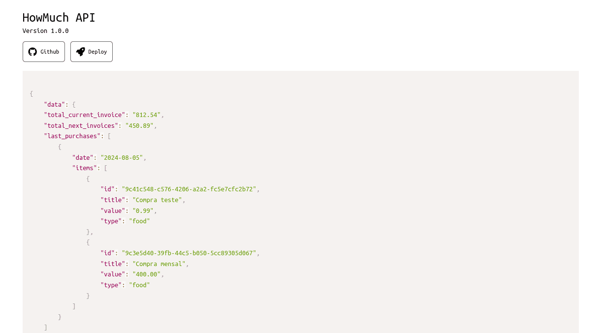

# HowMuch API

Essa é a API da aplicação HowMuch (gerenciador de gastos), ela foi construída utilizando PHP com Laravel.

## Screenshots



## Stack utilizada

-   PHP 8.2
-   Laravel 11
-   PostgrSQL
-   Cloudinary
-   Jwt-auth

## Funcionalidades

-   Autenticação com email/senha.
-   Autorização utilizando JWT.
-   Endpoints para visualização, criação e remoção de compra.
-   Endpoint de visualização de fatura atual.
-   Endpoint de visualização de uma fatura específica a partir do id.
-   Endpoint de visualização de proxímas faturas.
-   Endpoint para adicionar uma imagem do perfil para o usuário.

## Documentação da API

[Swagger da API](https://how-much.iarlenreis.com.br/api/documentation)

### Faturas (Invoices)

#### Retorna a fatura atual do usuário

```http
  GET /api/invoices/current-invoice
```

| Parâmetro | Tipo     | Requerido | Descrição |
| :-------- | :------- | :-------- | :-------- |
| `token `  | `string` | Sim       | Token JWT |

#### Retorna uma fatura a partir do id.

```http
  GET /api/invoices/${id}
```

| Parâmetro | Tipo     | Requerido | Descrição    |
| :-------- | :------- | :-------- | :----------- |
| `ID `     | `string` | Sim       | ID da fatura |
| `token `  | `string` | Sim       | Token JWT    |

#### Retorna as proxímas faturas do usuário

```http
  GET /api/invoices/next-invoices
```

| Parâmetro | Tipo     | Requerido | Descrição |
| :-------- | :------- | :-------- | :-------- |
| `token `  | `string` | Sim       | Token JWT |

#### Retorna os dados de uma fatura a partir do id formatado para o padrão do grafico.

```http
  GET /api/invoices/${id}/chart
```

| Parâmetro | Tipo     | Requerido | Descrição    |
| :-------- | :------- | :-------- | :----------- |
| `ID `     | `string` | Sim       | ID da fatura |
| `token `  | `string` | Sim       | Token JWT    |

### Compras (Purchases)

#### Retorna todas as compras do usuário

```http
  GET /api/purchase
```

| Parâmetro | Tipo     | Requerido | Descrição |
| :-------- | :------- | :-------- | :-------- |
| `token `  | `string` | Sim       | Token JWT |

#### Cria uma nova compra.

```http
  POST /api/purchase
```

| Parâmetro      | Tipo       | Requerido | Descrição                              |
| :------------- | :--------- | :-------- | :------------------------------------- |
| `title `       | `string`   | Sim       | Titulo da compra                       |
| `type `        | `string`   | Sim       | Tipo da compra                         |
| `value `       | `decimal`  | Sim       | Valor da compra                        |
| `date `        | `datetime` | Sim       | Data da fatura para adicionar a compra |
| `description ` | `string`   | Não       | Descrição da compra                    |
| `token `       | `string`   | Sim       | Token JWT                              |

#### Retorna uma compra a partir do id

```http
  GET /api/purchase/${id}
```

| Parâmetro | Tipo     | Requerido | Descrição    |
| :-------- | :------- | :-------- | :----------- |
| `ID `     | `string` | Sim       | ID da compra |
| `token `  | `string` | Sim       | Token JWT    |

#### Deleta uma compra a partir do id

```http
  DELETE /api/purchase/${id}
```

| Parâmetro | Tipo     | Requerido | Descrição    |
| :-------- | :------- | :-------- | :----------- |
| `ID `     | `string` | Sim       | ID da compra |
| `token `  | `string` | Sim       | Token JWT    |

#### Retorna as últimas 5 compras do usuário com o valor da fatura atual e das pŕoximas faturas

```http
  GET /api/purchase/last-purchases
```

| Parâmetro | Tipo     | Requerido | Descrição |
| :-------- | :------- | :-------- | :-------- |
| `token `  | `string` | Sim       | Token JWT |

### Upload

#### Faz o upload da imagem do perfil do usuário

```http
  POST /api/auth/resgister
```

| Parâmetro | Tipo                  | Requerido | Descrição                       |
| :-------- | :-------------------- | :-------- | :------------------------------ |
| `file `   | `multipart/form-data` | Sim       | Imagem para o perfil do usuário |
| `token `  | `string`              | Sim       | Token JWT                       |

### Autenticação

#### Cria um novo usuário

```http
  POST /api/auth/resgister
```

| Parâmetro   | Tipo     | Requerido | Descrição         |
| :---------- | :------- | :-------- | :---------------- |
| `name `     | `string` | Sim       | Nome do usuário   |
| `email `    | `string` | Sim       | E-mail do usuário |
| `password ` | `string` | Sim       | Senha do usuário  |

#### Faz o login do usuário e retorna um token jwt para usar nas requisições

```http
  POST /api/auth/login
```

| Parâmetro   | Tipo     | Requerido | Descrição         |
| :---------- | :------- | :-------- | :---------------- |
| `email `    | `string` | Sim       | E-mail do usuário |
| `password ` | `string` | Sim       | Senha do usuário  |
